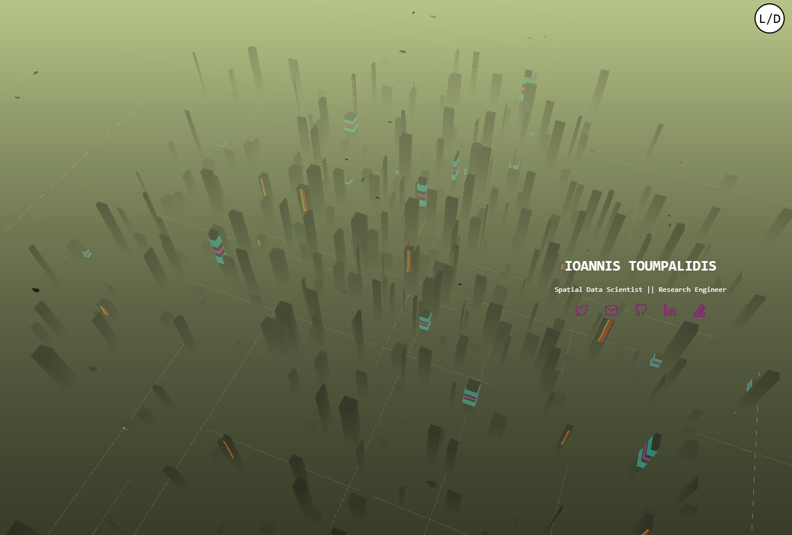

# PRISM

PRISM is a personal project I had in WIP for a few years. Here is the repo where I will try to push updates as much as possible. The idea behind it is to set a digital garden type of a website. For now the immediate goals is to set up a tech stack that can transform simple markdown docs to html pages in the website. 

## Non Functional Rq

- [ ] Aesthetics
- [ ] Readability 
- [ ] Accecibility
- [ ] Extensibility 

## Functional Rq

- [ ] Aesthetics
	- [ ]  Procedural City to chagne with reload
- [ ] Transform markdown to html pages using pre defined templates
- [ ] Floating window for wikipedia search 
- [ ] Floating window to render parts of other interal page / content (gwern.net)

## Since you are here..

You might be interest for the tech used. I will try to provide as much information as possible for the following in dedicated pages 

- Procedural City-like Generation
  - 	[Buildings & Signs](./src/buildings.js)
  - 	[Roads](roads.js)
  - 	[Moving Vehicles](./src/car.js)
- [Markdown to pages (python)](transform.py)

## If actually anyone came here

Please reach out if anything! 

## Main inspiration, important tools

- [gwern.net](https://gwern.net/)
- [https://obsidian.md/](https://obsidian.md/)

